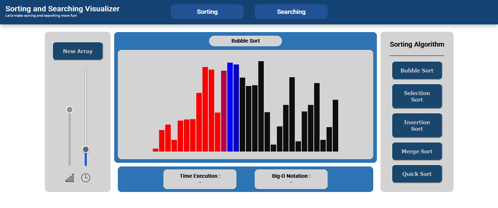

# Sorting and Searching Visualizer
Help you understand sorting and searching algorithms more easily. As well as conducting simulations to learn the patterns of each algorithm.
* Pick the size of array and speed of process!
* Auto generate random array!
* See how long the time of execution and big-O notation

Can be used to teach CS students.

## Sorting Visualizer
Sorting Algorithm : 
1. Bubble Sort 
2. Selection Sort 
3. Merge Sort 
4. Insertion Sort 
5. Quick Sort 

## Searching Visualizer
Searching Algorithm : 
1. Linear Search 
2. Binary Search 

## Graph Visualizer
Graph Algorithm : 
1. BFS 
2. DFS 
3. Dijktra's 

## How it looks?
Sorting visualizer : 
  

## Still in development:)
Adding more algorithm!
